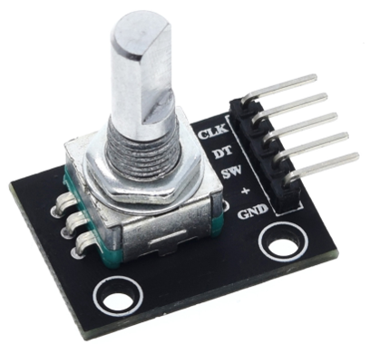

# fStopTimer
Arduino enlarger fStop timer project. Simple ergonomics useful in the darkroom.

fStop timer features:
- time measurement in fStops
- time measurement in seconds
- test stripes
- dodge/burn option
- pause
- print parameters log stored on SD card
- safe light control
- enlarger control
- easy to operate - one knob, two buttons and one foot switch

Parts list:
TZT Arduino Nano 3.0 clone

0.96" oled SSD1306 I2C yellow-blue OLED Display Module 128X64

TZT 360 Degrees Rotary Encoder Module

2x Tactile Momentary Switch

TZT 5v 1 channel relay

TZT Micro SD Storage Expansion Board

Buzzer

4x DC Power Connector 2.1x5.5mm male/female

On/Off switch

Foot switch

120W 12V DC power source

Darkroom safe light (12V LED modification)

Enlarger (75-100W halogen or 10-15W LED light source)